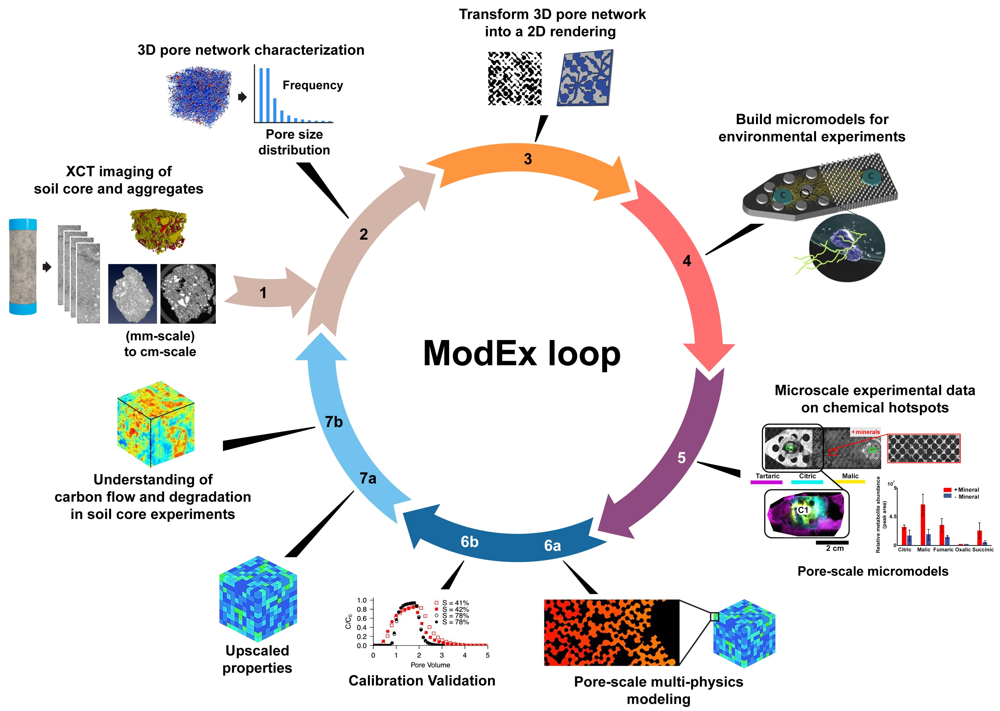

.. Pore2Chip documentation master file, created by
   sphinx-quickstart on Thu Jan  2 09:45:53 2025.
   You can adapt this file completely to your liking, but it should at least
   contain the root `toctree` directive.

Pore2Chip Documentation
=======================
A python package that takes XCT images of porous materials and generates representative digital twin micromodels.

ModEx Loop for Pore2Chip and Chip2Flow

About Pore2Chip
---------------
**Pore2Chip** is a Python module designed to streamline the process of analyzing X-ray computed tomography (XCT) 
images of soil and creating 2D micromodel designs based on that analysis. 
It leverages the power of open-source libraries like OpenPNM, PoreSpy, and drawsvg to extract key information about the soil's 
porous structure and translate it into a blueprint for microfluidic simulations or physical "lab-on-a-chip" devices developed using additive manufacturing.

User Guide
----------
.. toctree::
   :maxdepth: 1

   install
   quickstart
   module_ref

Acknowledgements
----------------
This research was performed on a project award (Award DOIs: 10.46936/ltds.proj.2024.61069/60012423; 10.46936/intm.proj.2023.60674/60008777; 10.46936/intm.proj.2023.60904/60008965) 
from the Environmental Molecular Sciences Laboratory, a DOE Office of Science User Facility sponsored by the Biological and Environmental Research program under contract no. DE-AC05-76RL01830. 
The authors acknowledge the contributions of Michael Perkins at PNNL’s Creative Services, who developed the conceptual graphics in this paper.

PNNL-SA-197910

Disclaimer
----------
This research work was prepared as an account of work sponsored by an agency of the United States Government. Neither the United States Government nor any agency thereof, 
nor any of their employees, makes any warranty, express or implied, or assumes any legal liability or responsibility for the accuracy, completeness, or usefulness of any information, 
apparatus, product, or process disclosed, or represents that its use would not infringe privately owned rights. Reference herein to any specific commercial product, process, 
or service by trade name, trademark, manufacturer, or otherwise does not necessarily constitute or imply its endorsement, recommendation, or favoring by the United States Government or any agency thereof. 
The views and opinions of authors expressed herein do not necessarily state or reflect those of the United States Government or any agency thereof.

.. note::

   This project is under active development.

