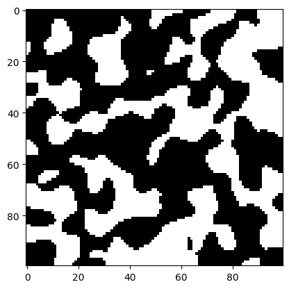
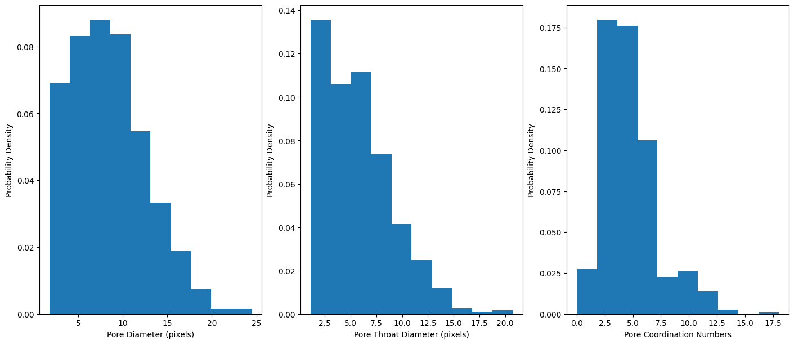
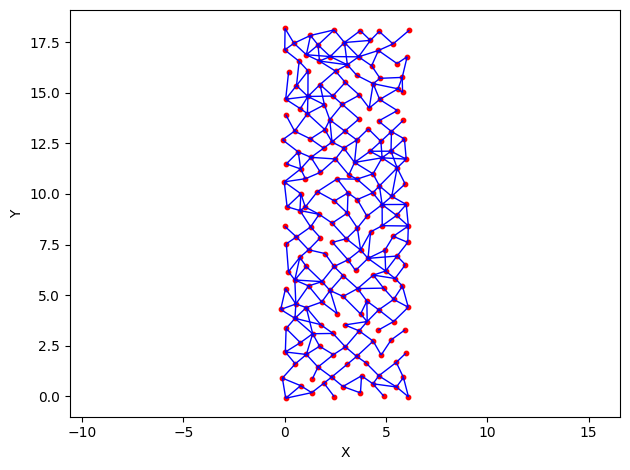
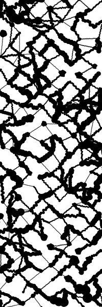

Quickstart Guide
=======================

This guide is meant to showcase the basics of micromodel design and file exporting.

Step 1: Importing Libraries
---------------------------
Before starting, we will import Pore2Chip as well as some support libraries for data visualization and modification.

.. literalinclude:: ./examples/quickstart_example.py
   :language: python
   :start-after: # Step 1 Start
   :end-before: # Step 1 End

Step 2: Loading Desired Data
----------------------------
In order to extract data from XCT images, we need to load it into memory as a 3D array of pixel values. This can be done 
all in one step using Pore2Chip's built-in function ``read_and_filter_list``. Other parameters such as cropping the image, 
custom threshold values, and gray value masking can also be set in the function parameters.

.. literalinclude:: ./examples/quickstart_example.py
   :language: python
   :start-after: # Step 2 Start
   :end-before: # Step 2 End

Step 3: Pore Data Extraction
----------------------------
Now that the segmented data is loaded into memory, we will use the ``metrics`` module to extract the necessary information needed to 
cunstruct the micromodel design. This extraction is based on pore network extraction via watershed segmentation and the SNOW 
algorithm provided by `Porespy`.

First, we will extract the pore and pore throat diameters:

.. literalinclude:: ./examples/quickstart_example.py
   :language: python
   :start-after: # Step 3.1 Start
   :end-before: # Step 3.1 End

Next, we will extract the pore coordination numbers:

.. literalinclude:: ./examples/quickstart_example.py
   :language: python
   :start-after: # Step 3.2 Start
   :end-before: # Step 3.2 End

The variables we extracted are arrays that contain all of the pore diameters, throat diameters, and coordination numbers for all the 
extracted pores in the pore network. We can visualize the distribution of the data using `matplotlib`:

.. literalinclude:: ./examples/quickstart_example.py
   :language: python
   :start-after: # Step 3.3 Start
   :end-before: # Step 3.3 End

.. note::

   Keep in mind that the data that is extracted is measured in the number of pixels in the segmented image. If you know the resolution 
   size of the original XCT scan, you can scale the pixel values by the voxel size from the XCT metadata. Alternatively, you can keep note 
   of the voxel/volume scale and adjust scaling on the final micromodel design.

Step 4: Micromodel Network Generation
-------------------------------------
Once all the necessary data is extracted (pore diameters, throat diameters, and coordination numbers), we can move on to designing the micromodel. 
Pore2Chip creates micromodels by constructing a 2D pore network (backed by `OpenPNM`) that has the overall pore properties that we extracted 
in step 2. Then, the network is converted from a digital representation to a shape representation using `drawsvg`.

To construct the 2D `OpenPNM` network, we will use the ``generate_network()`` function in the ``generate`` module:

.. literalinclude:: ./examples/quickstart_example.py
   :language: python
   :start-after: # Step 4 Start
   :end-before: # Step 4 End

The code above generates a network that is a diamond lattice of 6 x 18 pores. The ``generate_network()`` function has parameters for the number of 
pores on the X and Y axis, diameters, coordination numbers, and other optional arguments such as ``center_channel``, which was used above. The 
argument or 3 designates a column of pores (3-wide) than the micromodel must connect from top to bottom, ensuring connectivity throughout the 
entire network (more info on the generation algorithm in the modules page WIP).

Step 5: Micromodel Exporting
-------------------------------------
Once we have our desired network, we will export it as a micromodel that can be used in simulations or fabrication for microfluidic experiments. This 
is done with the ``export`` module. We will use ``network2svg()`` to export our micromodel as a scalable vector graphic:

.. literalinclude:: ./examples/quickstart_example.py
   :language: python
   :start-after: # Step 5 Start
   :end-before: # Step 5 End

This is what the exported SVG based on the `OpenPNM` network looks like:

This vector image can be used as is for fabrication, or imported into other software such as InkScape for further modification and exported as a 
DWG file compatible with most CAD software. There is also a function in ``export`` called ``network2dxf()``, which can export a network to a DXF 
file that most CAD software understands, but is currently still being refined (WIP).

.. note::

   This project is under active development.
