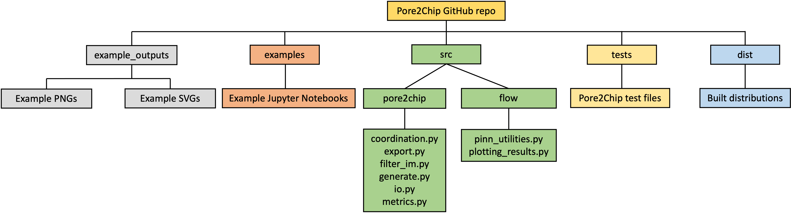

# Summary

The `Pore2Chip` is a Python package designed to create two-dimensional micromodels using extracted data from three-dimensional X-ray computed tomography (XCT) images. 
Micromodels are two-dimensional representations of pore systems that replicate natural porous media, enabling detailed study of fluid dynamics, reactive-transport, and thermal energy at the pore scale [@karadimitriou2012review; @anbari2018microfluidic]. 
These models are crucial for advancing soil science by providing insights into microbial interactions and chemical processes in Earth and energy systems [@isah2022fluid; @zhu2022microfluidics; @@aralekallu2023development].
This `Pore2Chip` package helps analyze soil structure and function, allowing for the investigation of environmentally significant biogeochemical processes that impact soil organic matter (SOM) decomposition and loss, oxygen concentrations, and nutrient availability in disturbed or managed soils.
It can produce pore networks that accurately represent soils, convert any 3D pore network into scalable SVG images with precise pore and pore throat sizes, and conduct computational simulations on these images. 
The extracted data includes characterizations of the pore network using major water retention and flow metrics relevant to porous materials. 
Key metrics encompass pore size distributions, pore throat size distributions, porosity, tortuosity, and connectivity (pore coordination numbers).
The software's final output is a 2D lab-on-chip micromodel designs representing a soil core or its aggregate. It can be printed using additive manufacturing methods such as laser etching, 3D printing, and photolithography. 
These 3D-printed designs accurately depict the XCT-resolved pore networks for soil science applications.

# Statement of need

The resilience of agricultural and natural landscapes is intrinsically connected to soil structure. 
Land management (e.g., tillage, grazing, and fire) and associated impacts (e.g., compaction and pore-clogging) along with climate disturbances (e.g., freeze-thaw, flooding, and sea level rise) can transform soil microstructure [@liu2018; @feng2020; @stoof2016; @oliveira2022; @rooney2022]. 
These changes in the soil microstructure determine the flow of water, solutes, and gases, as well as SOM retention, transport, and distribution [@hamamoto2010; @waring2020; @guo2024; @bailey2017]. 
Simplified, homogeneous pore networks provide innovative demonstrations of how water, solutes, and microbes interact [@bhattacharjee2022] but need more accurate representations of soil properties. 
Heterogeneous synthetic habitats are more realistic but time-consuming to design and do not include pore network characteristics, such as pore connectivity or pore throat measurements. 
Incorporating pore dynamics into soil models, such as SOM degradation, enables dynamic predictions for soil responses under changing pore networks [@davidson2011; @moyano2018].

Our understanding of how pore network characteristics govern hydrobiogeochemical processes in pre- and post-disturbance soils and across soil types is constrained by current micromodel-based experimental designs. Currently, there is no software available to seamlessly provide various micromodel designs that researchers can test and validate with minimal computational cost [@dentz2023; @oostrom2014]. 
`Pore2Chip` allows us to overcome this barrier by providing the intended users, such as earth scientists and lab-on-chip instrument specialists, with easy-to-use research software for lab-on-chip designs. 
Specifically, the `Pore2Chip`-based data worth analysis of high-resolution XCT images allows us to fill this experimental design gap by providing a 3D model of the microscale pore structure. 
This `Pore2Chip` capability allows the users to build a representative quasi-2D pore network along with first-order, fast, and reasonably accurate flow models that can be linked with soil experiments. 
These `Pore2Chip` flow models are built using recent advances in physics-informed neural networks [@new2024], laying the foundation to accelerate numerical simulations and improve the fidelity of predictions in microscale environments. 
Moreover, `Pore2Chip` allows one to assess the impact of various system parameters, such as pore structures, fluid properties, and flow conditions, needed to develop optimal micromodel experiments. 
Such a capability can guide model-experiment-data (ModEx) integration at the microscale, allowing for upscaling microscale processes and predictions of dynamic soil properties and functions. 
See \autoref{fig:fig1}.

## Main features and differences with other tools

Sphere packing algorithms are often used to simulate soil structures in a simplified 2D design. 
However, this approach only deals with individual grain size distributions and grain clustering without allowing control over important porous properties such as pore connectivity and size distributions. 
`Pore2Chip` addresses this limitation by representing pore networks as connected shapes. 
This enables users to easily create and control pore networks representing various real-world conditions. 
While `Pore2Chip` does not control the shape of the solid space like sphere packing algorithms, it can be adjusted by altering overall micromodel properties, such as changing the number of pores or the micromodel size in pixels. 
`Pore2Chip` offers experimental design capabilities that cannot be achieved by existing software such as `epyc` [@dobson2022]. 
It is similar in spirit to `PoreSpy` [@gostick2016], emphasizing quantitative analysis of porous media images. 
However, `Pore2Chip` provides better support and reproducibility for developing lab-on-chip experimental designs uniformly across different soil datasets with fast, reasonably accurate, first-order flow modeling capabilities. 
Microscale experimental designs using printed `Pore2Chip`-based micromodels may target both abiotic and biotic processes and be integrated into modeling efforts such as fluid flow modeling, reactive transport modeling, and microbial activity simulations.

## Implementation details and support libraries

Using `OpenPNM` [@gostick2016] and various graphics rendering libraries (e.g., `drawsvg`, `ezdxf`, `svglib`, `cairosvg`, `reportlab`), `Pore2Chip` renders SVG or DXF micromodel designs using porous properties of the desired XCT images or similar 3D imaging sources. 
Output designs are scalable and adjustable based on the target porosity of the micromodel. 
While the pore sizes, throat sizes, and coordination numbers are required for generation, other information, such as the number of pores per XCT image slice, can be used to adjust the final micromodel. 
The user can change the number of pores in the generated pore network and adjust the image’s final output size to modify the micromodel’s total porosity. 
Once the network is generated, it can be exported as micromodel data in SVG or DXF formats and VTK formats for visualization in `Paraview` or microfluidic simulations with open-source software such as `PFLOTRAN` (<https://www.pflotran.org>), `OpenFOAM` (<https://www.openfoam.com>), and other physics-informed neural network modules.
If the user wants to extract data from XCT images, `Pore2Chip` has image filtering and network extraction modules utilizing Otsu thresholding and `PoreSpy`. 
The generation function can also work with data extracted by other means if it is an array of values that Python can read.

# Figures

# Acknowledgement and disclaimer

This research was performed with support from the Environmental Molecular Sciences Laboratory, a DOE Office of Science User Facility sponsored by the Biological and Environmental Research program under contract no. DE-AC05-76RL01830. 
The views and opinions of authors expressed herein do not necessarily state or reflect those of the United States Government or any agency thereof. 

# References
